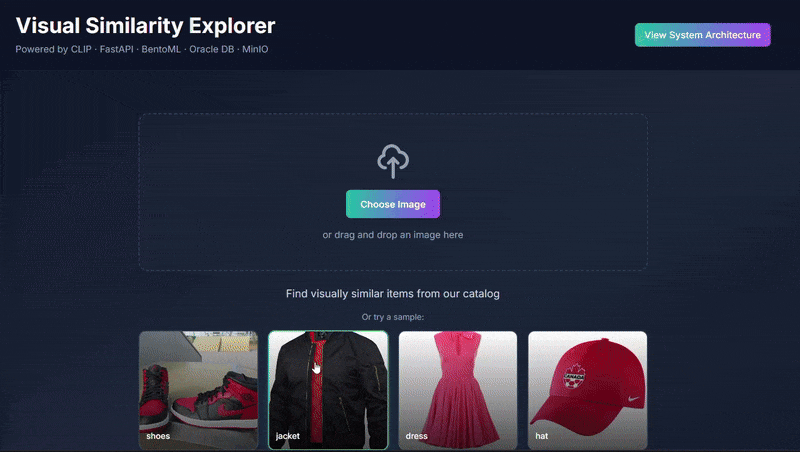

# 🔍 Product AI Image Similarity Platform

> **A production-grade, microservices-based visual search engine powered by OpenAI CLIP and vector similarity search**

[](https://www.docker.com/)
[](https://fastapi.tiangolo.com/)
[](https://reactjs.org/)
[](https://bentoml.com/)
[](https://www.oracle.com/database/)

## 📖 Overview

This platform demonstrates a **complete end-to-end solution** for visual product search using state-of-the-art deep learning. Users can upload an image of any product, and the system returns visually similar products from the database using semantic image embeddings rather than traditional metadata-based search.

## 🎬 Demo



**Upload any product image and get visually similar products in real-time**

**Live Demo:** Deployed on Oracle Kubernetes Engine (OKE) - *Public link coming soon!*

### 🎯 The Challenge

Building a production-ready image similarity system requires solving several complex problems:

- **Semantic Understanding**: Traditional image search relies on tags and metadata. This system uses CLIP (Contrastive Language-Image Pre-training) to understand images at a semantic level, capturing textures, patterns, colors, and object relationships
- **High-Dimensional Vector Search**: Finding similar images means searching through 512-dimensional embedding spaces efficiently
- **Scalable ML Inference**: Serving deep learning models in production requires proper containerization, versioning, and API management
- **Distributed Systems Architecture**: Coordinating multiple services (API gateway, ML inference, object storage, database) with proper error handling and data consistency
- **Production-Grade Deployment**: Full containerization, automated testing, and infrastructure-as-code for reproducible deployments

## 🏗️ Architecture

This is a **distributed microservices architecture** with five specialized services communicating over Docker networks:

```
┌─────────────────────────────────────────────────────────────────┐
│                         User Interface                          │
│                     React SPA (Port 80)                         │
└────────────────────────────────┬────────────────────────────────┘
                                 │ HTTP/REST
┌────────────────────────────────▼────────────────────────────────┐
│                      Backend API Gateway                        │
│              FastAPI (Python 3.11) - Port 8000                  │
│  • Request validation & routing                                 │
│  • Business logic orchestration                                 │
│  • Service coordination                                         │
└───────┬─────────────────────────┬────────────────────┬──────────┘
        │                         │                    │
        │ gRPC                    │ S3 API            │ SQL
        │                         │                    │
┌───────▼──────────┐   ┌──────────▼────────┐   ┌─────▼──────────┐
│  ML Service      │   │  Object Storage   │   │    Database    │
│  (BentoML)       │   │     (MinIO)       │   │    (Oracle)    │
│                  │   │                   │   │                │
│ • CLIP Model     │   │ • Image Storage   │   │ • Products     │
│ • Embedding Gen  │   │ • S3 Compatible   │   │ • Embeddings   │
│ • Batch Inference│   │ • Scalable Blob   │   │ • Vector Ops   │
└──────────────────┘   └───────────────────┘   └────────────────┘
```

### 🔧 Technology Stack

| Component | Technology | Purpose |
|-----------|-----------|---------|
| **Frontend** | React 18, JavaScript | Responsive SPA with modern UI/UX |
| **Backend** | FastAPI, Python 3.11, Pydantic | High-performance async API with automatic validation |
| **ML Serving** | BentoML, OpenAI CLIP | Production ML model serving with automatic API generation |
| **Database** | Oracle Database | Enterprise-grade storage with vector search capabilities |
| **Object Storage** | MinIO | AWS S3-compatible distributed object storage |
| **Orchestration** | Docker Compose | Multi-container application orchestration |
| **CI/CD** | GitHub Actions | Automated testing and quality assurance |

## 🚀 Key Features & Technical Highlights

### 🧠 Advanced ML Pipeline
- **OpenAI CLIP Model**: Vision transformer trained on 400M image-text pairs for zero-shot visual understanding
- **512-Dimensional Embeddings**: Dense vector representations capturing semantic meaning
- **BentoML Serving**: Production ML serving with automatic API generation, batching, and model versioning

### 🔎 Vector Similarity Search
- **Cosine Similarity**: Efficient high-dimensional similarity computation
- **Oracle Vector Integration**: Database-level vector operations for performance
- **Scalable Retrieval**: Supports millions of products with sub-second queries

### 🏢 Production-Ready Architecture
- **Microservices Design**: Independently scalable services
- **Full Containerization**: Optimized Docker images for all components
- **Kubernetes Deployment**: Production orchestration on Oracle Kubernetes Engine (OKE)
- **Horizontal Scaling**: Load-balanced ML service instances
- **Health Checks & Monitoring**: Service health probes and graceful degradation

---

## 🏁 Quick Start

### Prerequisites

- **Docker** (v20.10+) and **Docker Compose** (v2.0+)
- **Python** 3.11+ (for database population script)
- Minimum 8GB RAM (16GB recommended for ML inference)
- 10GB free disk space

### Installation & Setup

1. **Clone the repository**
   ```bash
   git clone https://github.com/Abdeljalil-Ounaceur/Product-AI-Image-Similarity-Platform.git
   cd Product-AI-Image-Similarity-Platform
   ```

2. **Configure environment variables**
   ```bash
   cp .env.example .env
   # Edit .env with your configuration
   ```

3. **Start all services**
   ```bash
   docker-compose up -d
   ```
   
   This command will:
   - Pull/build all required Docker images
   - Start 5 containerized services
   - Set up networks and volumes
   - Initialize the database schema

4. **Wait for services to be ready** (30-60 seconds)
   ```bash
   # Check service health
   docker-compose ps
   ```

5. **Populate the database with sample data**
   ```bash
   cd database-setup
   pip install requests python-dotenv
   python populate_products.py
   ```
   
   This script will:
   - Download sample product images
   - Upload images to MinIO object storage
   - Generate embeddings using the ML service
   - Store products and embeddings in Oracle DB

6. **Access the application**
   
   Open your browser and navigate to:
   ```
   http://localhost:80
   ```

### Service Endpoints

| Service | URL | Description |
|---------|-----|-------------|
| Frontend | http://localhost:80 | Main application interface |
| Backend API | http://localhost:8000 | REST API endpoints |
| API Docs | http://localhost:8000/docs | Interactive API documentation |
| ML Service | http://localhost:3000 | BentoML inference API |
| MinIO Console | http://localhost:9001 | Object storage management |

### Troubleshooting

**Services not starting?**
```bash
docker-compose logs [service-name]
```

**ML Service taking too long?**
- First-time model download can take 5-10 minutes
- Check logs: `docker-compose logs ml-service`

**Database connection issues?**
```bash
docker-compose restart database
docker-compose logs database
```

## 🔬 Technical Deep Dive

### How It Works

1. **Image Upload**: User uploads an image through React frontend
2. **Preprocessing**: Backend validates and stores image in MinIO
3. **Embedding Generation**: ML service generates 512-dim CLIP embedding
4. **Vector Search**: Database performs cosine similarity search against stored embeddings
5. **Results Retrieval**: Top-K similar products returned with similarity scores
6. **Response**: Frontend displays results with product details and images

### Key Implementation Decisions

**Why CLIP over ResNet/VGG?**
- CLIP understands semantic similarity, not just visual features
- Pre-trained on diverse internet data (400M+ pairs)
- Zero-shot capabilities without fine-tuning

**Why BentoML?**
- Production-ready ML serving framework
- Automatic API generation and containerization
- Built-in performance optimizations (batching, caching)
- Easy model versioning and deployment

**Why Oracle Database?**
- Native vector operations for similarity search
- ACID compliance for data integrity
- Enterprise features (backup, replication, monitoring)

**Why MinIO over AWS S3?**
- Self-hosted, no vendor lock-in
- S3-compatible API (easy migration path)
- Lower latency for local development
- Cost-effective for on-premise deployments

## 🛣️ Roadmap & Milestones

### ✅ Completed

- [x] Core microservices architecture (5 services)
- [x] Full containerization with Docker Compose
- [x] CLIP-based semantic image embeddings
- [x] Vector similarity search implementation
- [x] React-based responsive UI
- [x] GitHub Actions CI/CD pipeline
- [x] Automated database population scripts
- [x] Health checks and monitoring
- [x] Kubernetes deployment on Oracle Kubernetes Engine (OKE)
- [x] Horizontal scaling with load-balanced ML service instances

### 🚧 In Progress

- [ ] Enhanced UI with filtering and sorting
- [ ] Public demo link deployment

### 🔮 Future Enhancements

- [ ] **Hybrid Search**: Combine visual similarity with text-based search
- [ ] **Advanced Filtering**: Filter by category, price, brand alongside similarity
- [ ] **Monitoring Stack**: Prometheus + Grafana for metrics and alerting
- [ ] **Expanded Dataset**: Larger product catalog with diverse categories
- [ ] **Multi-modal Search**: Search using text, image, or both
- [ ] **Real-time Indexing**: Stream product updates to the search index

## 🙏 Acknowledgments

- **OpenAI** for the CLIP model
- **BentoML** team for the excellent ML serving framework
- **FastAPI** for the high-performance web framework
- Open-source community for the amazing tools and libraries

## 📧 Contact

**Abdeljalil Ounaceur**

- GitHub: [@Abdeljalil-Ounaceur](https://github.com/Abdeljalil-Ounaceur)
- LinkedIn: [linkedin.com/in/abdeljalil-ounaceur](https://linkedin.com/in/abdeljalil-ounaceur)
- Email: ounaceur.abdeljalil@gmail.com

---

<div align="center">
  
**If you found this project helpful, please consider giving it a ⭐!**

</div>